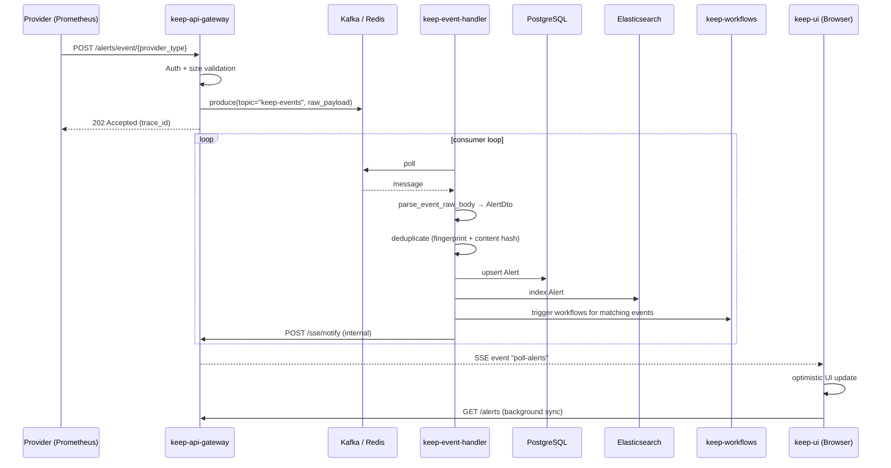
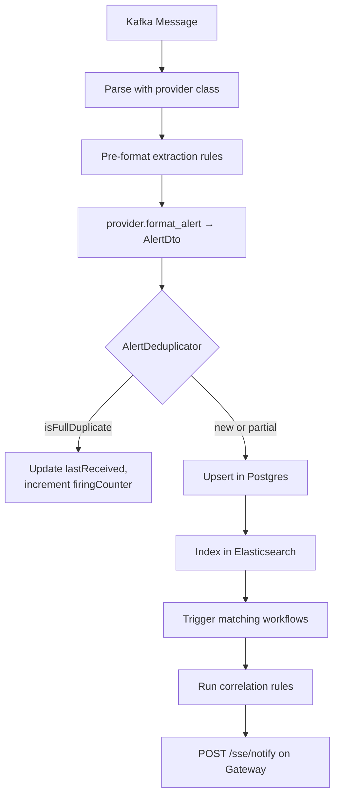

Keep is asynchronous by design. The path from a provider webhook to an alert appearing in the UI traverses three services, a message broker, and Server-Sent Events back to the browser. This page traces that path end-to-end.

## End-to-end flow



## Stage 1 — Ingestion (`keep-api-gateway`)

The Gateway's job is **only** to accept the request and put it on the broker. It deliberately does not parse the payload.

1. **Auth**. `IdentityManagerFactory.get_auth_verifier(["write:alerts"])` validates the JWT or API key.
2. **Size check**. The Gateway rejects payloads larger than the configured limit before reading them.
3. **Produce**. The configured `EventProducer` (`KafkaEventProducer` by default) serializes the body and writes it to the broker.
4. **Respond**. `202 Accepted` is returned with a `trace_id` the caller can use for correlation.

**File reference**: `keep-api-gateway/src/routes/alerts.py`, `keep-api-gateway/src/services/producers/`.

```python
# Conceptual — see src/routes/alerts.py for the real route
producer = await get_event_producer()
await producer.produce(
    topic="keep-events",
    payload=raw_body,
    key=tenant_id,
)
return JSONResponse(202, {"trace_id": trace_id})
```

## Stage 2 — Processing (`keep-event-handler`)

The Event Handler is where the actual work happens. The standalone consumer (`consumer_main.py`) runs a `confluent-kafka` poll loop; for each message it calls `process_event_sync`.



### The actual ordered pipeline

The orchestrator is `keep-event-handler/event_management/process_event_task.py::process_event` (called from `controllers/event_controller.py::process_event_sync`). The steps below are the order they run in — every one is a separate OpenTelemetry span:

1. **Span init** — `tracer.start_as_current_span("process_event")` opens the trace.
2. **Provider class load** — `ProvidersFactory.get_provider_class(provider_type)` runs `importlib.import_module(f"providers.{type}_provider.{type}_provider")`. Sub-types like `cloudwatch.logs` split on `.` and load `CloudwatchProvider`.
3. **Raw-body normalization** — `provider_class.parse_event_raw_body(event)` (a no-op for most providers; non-trivial for ones whose webhook posts a string instead of JSON, e.g. Parseable).
4. **Pre-format extraction** — `EnrichmentsBl.run_extraction_rules(event, pre=True)`. Tenant-defined CEL rules pull fields out of the raw payload **before** the provider sees it.
5. **Provider formatting** — `provider_class.format_alert(tenant_id, event, provider_id, provider_type)` returns `AlertDto | list[AlertDto] | None`. `None` means the provider chose to ignore this event.
6. **Post-format extraction** — `EnrichmentsBl.run_extraction_rules(alert, pre=False)`. The same machinery, this time against the normalized DTO.
7. **Maintenance window check** — `MaintenanceWindowsBl(tenant_id, session).check_if_alert_in_maintenance_windows(alert)`. Each enabled rule whose time window covers `now` is evaluated as a CEL expression (`celpy.Environment()`); on a hit, the alert's status is forced to `AlertStatus.MAINTENANCE`, the `alerts_maintenance_silenced_total{tenant_id, window_id, window_name}` counter increments, and an audit row is created.
8. **Deduplication** — `AlertDeduplicator(tenant_id).apply_deduplication(alert, rules)`. Sets `isFullDuplicate` / `isPartialDuplicate` (algorithm in [Event Handler / Deduplication](/services/event-handler#deduplication)).
9. **Persistence** — `set_last_alert(...)` bulk-upserts the alert row.
10. **Search indexing** — `ElasticClient(tenant_id).index_alerts(...)` — gated on `ELASTIC_ENABLED` and tenant-level `search_mode` config. No-op otherwise.
11. **Workflow trigger** — call into `keep-workflows` (`WorkflowManager.insert_events`) so workflows whose `on:` clause matches this alert are scheduled.
12. **Rules engine** — `RulesEngine(tenant_id).evaluate_rules(alert)` runs correlation/suppression CEL rules and may attach the alert to an existing incident or create a new one.
13. **SSE notify** — `notify_sse(tenant_id, "poll-alerts", {...})`. Internal HTTP POST to the Gateway's `/sse/notify`; the Gateway fans out to every browser subscribed for `tenant_id`.

Each stage is feature-flagged. Check these before changing default behaviour:

| Env var | Default | Effect when off |
| --- | --- | --- |
| `ELASTIC_ENABLED` | `false` | Step 10 skipped. Alerts only live in Postgres. |
| `KEEP_STORE_RAW_ALERTS` | `false` | Raw payload is *not* persisted alongside the DTO. |
| `KEEP_ALERT_FIELDS_ENABLED` | `true` | The `AlertField` table (used by dynamic facets) is not updated. |
| `KEEP_MAINTENANCE_WINDOWS_ENABLED` | `true` | Step 7 skipped. |
| `KEEP_AUDIT_EVENTS_ENABLED` | `true` | No audit rows for state changes. |
| `KEEP_CALCULATE_START_FIRING_TIME_ENABLED` | `true` | `firingStartTime` not computed. |
| `KEEP_DEDUPLICATION_DISTRIBUTION_ENABLED` | (config) | No `deduplication_event` rows for stats dashboards. |

**File reference**: `keep-event-handler/event_management/process_event_task.py`, `keep-event-handler/controllers/event_controller.py`, `keep-event-handler/core/kafka_consumer.py`, `keep-event-handler/alert_deduplicator/`, `keep-event-handler/bl/maintenance_windows_bl.py`.

## Stage 3 — Realtime UI (`keep-api-gateway` → `keep-ui`)

The Gateway is the **only** service that talks to browsers. The Event Handler signals the Gateway via an internal POST; the Gateway fans out to every connected SSE client.

Events fired:

| Event | Payload |
| --- | --- |
| `poll-alerts` | New / changed alerts; UI optimistically appends them. |
| `incident-change` | Incident created or updated; UI re-fetches the incident. |
| `poll-presets` | Saved-search counters; UI re-renders the sidebar. |
| `topology-update` | Service topology changed. |

**File reference**: `keep-api-gateway/src/routes/sse_routes.py`, `keep/keep-ui/features/.../use*.ts`.

## The `AlertDto`

The shared schema between services is `AlertDto`. The canonical definition lives in `keep-event-handler/models/` (since that is where it is constructed) and is mirrored anywhere it is consumed.

| Field | Type | Notes |
| --- | --- | --- |
| `id` | `str` (UUID) | Generated server-side. |
| `name` | `str` | Title from the provider. |
| `status` | `AlertStatus` | `firing`, `resolved`, `acknowledged`, `suppressed`, `pending`, `maintenance`. |
| `severity` | `AlertSeverity` | `critical`, `high`, `warning`, `info`, `low`. |
| `lastReceived` | `str` (ISO 8601) | Updated on every duplicate. |
| `source` | `list[str]` | E.g. `["prometheus"]`. |
| `fingerprint` | `str` | SHA-256 of identifying fields — drives dedup. |
| `service` | `str` | Impacted service. |
| `environment` | `str` | `production`, `staging`, … |
| `pushed` | `bool` | `True` for webhooks; `False` if Keep pulled. |
| `labels` | `dict` | Free-form metadata. |
| `payload` | `dict` | Original raw body — kept for display/debug. |
| `firingStartTime` | `str` | When the alert first fired. |
| `firingCounter` | `int` | Continuous-firing count. |

## Failure handling today

- **Gateway → broker**: a broker outage returns 503 to the producer. The Gateway does not buffer locally.
- **Parse errors in the Event Handler**: logged and counted via `events_error_counter`; the message is acked to avoid head-of-line blocking. A proper Dead-Letter Queue is on the roadmap.
- **DB write errors**: bubble up; the consumer does not commit the offset, so the message will be redelivered.
- **Workflow execution errors**: scoped to the workflow run — they do not affect the alert pipeline.
