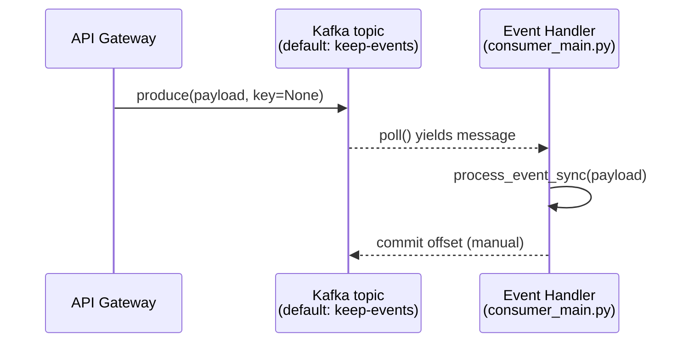
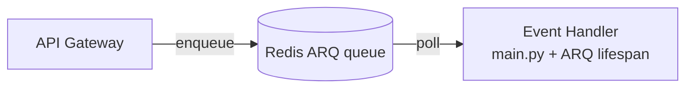

The Gateway and Event Handler are coupled only through a message broker. The choice of broker is controlled by a single environment variable; both services share the same `EventProducer` / `EventConsumer` abstractions.

## The contract

```python
# keep-api-gateway/src/services/producers/base_event_handler.py
class EventProducer(ABC):
    @abstractmethod
    async def produce(self, topic: str, payload: dict, key: str | None = None):
        """Send a message to the broker."""

# keep-event-handler/core/kafka_consumer.py
class EventConsumer(ABC):
    @abstractmethod
    def start(self): ...
    @abstractmethod
    def stop(self): ...
```

The producer side lives in `keep-api-gateway/src/services/producers/`; the consumer side lives in `keep-event-handler/core/`.

## Selecting the backend

The `MESSAGING_TYPE` environment variable controls which implementation is loaded:

| `MESSAGING_TYPE` | Producer | Consumer | Used for |
| --- | --- | --- | --- |
| `KAFKA` (default) | `KafkaEventProducer` (`confluent-kafka`) | `KafkaEventConsumer` standalone loop | Production |
| `REDIS` | ARQ pool (`keep_arq_queue_basic`) | ARQ worker via `core/lifespan.py` | Local development, smaller deployments |

Both services must agree on the value. Mixing them (e.g. Gateway producing to Kafka while the Handler runs on Redis) is **not** supported.

## Kafka path



The consumer is a **standalone process** (`consumer_main.py`) — not a worker inside a Gunicorn server. Reasons:

- The blocking `confluent-kafka` poll loop does not play well inside an ASGI worker.
- We want consumer lifecycle decoupled from API health.
- It allows independent horizontal scaling of consumer pods (one consumer per partition assignment).

The FastAPI `main.py` in the Event Handler is still useful — it exposes `/v1/health` and `/v1/metrics` for K8s probes and Prometheus scraping. Run both processes in the same container (or as a sidecar) in production.

### Kafka tuning

Most knobs are exposed as env vars on the consumer:

| Variable | Default | Purpose |
| --- | --- | --- |
| `KAFKA_BOOTSTRAP_SERVERS` | `localhost:29092` | Comma-separated list (also accepts JSON array). |
| `KAFKA_TOPIC` | `keep-events` | Topic to consume. |
| `KAFKA_CONSUMER_GROUP` | `keep-event-handler` | Group ID. Multiple replicas share work via partition assignment. |
| `KAFKA_POLL_TIMEOUT_SECONDS` | `1.0` | `consumer.poll(timeout)` argument. |
| `KAFKA_SESSION_TIMEOUT_MS` | `45000` | Heartbeat-based health check window. |
| `KAFKA_MAX_POLL_INTERVAL_MS` | `300000` | Maximum gap between poll calls before the consumer is kicked out of the group. Increase for slow handlers. |
| `KAFKA_SECURITY_PROTOCOL` | `PLAINTEXT` | One of `PLAINTEXT`, `SSL`, `SASL_SSL`. |
| `KAFKA_SASL_MECHANISM` | `PLAIN` | When using SASL. |
| `KAFKA_SSL_CAFILE` | `null` | Path to CA bundle for `SSL`/`SASL_SSL`. |
| `MAX_PROCESSING_RETRIES` | `3` | In-process retries before a message is given up on. |

### Consumer reliability

`KafkaEventConsumer` (`keep-event-handler/core/kafka_consumer.py`) deliberately runs synchronously with manual commits. The behaviour you should know about:

- **`enable.auto.commit=False`**. Offsets are committed via `consumer.commit(msg, asynchronous=False)` *after* `process_event_sync` returns successfully. A crash between processing and commit redelivers the message — designs need to be idempotent.
- **Partition rebalance hooks**. `_on_assign` / `_on_revoke` track partition movement. On revoke, current offsets are committed synchronously to avoid duplicate work after rebalance.
- **Per-message retry**. `_process_with_retries()` applies exponential backoff: `min(2 ** attempt, 10)` seconds, up to `MAX_PROCESSING_RETRIES` attempts. The offset is **not** committed on final failure → the message is redelivered on the next poll.
- **JSON-decode poison pills**. Messages that fail to deserialize as JSON are logged and **committed** anyway. The reasoning: a permanently-bad message would otherwise block the partition forever. This is a deliberate trade-off; if you need the bad bytes, scrape them from the consumer's logs before the pod rotates.
- **Consecutive-error breaker**. `10` consecutive errors raise `KafkaException`, which crashes the process. K8s reschedules. The threshold is hardcoded today (worth making tunable; tracked as a hardening item).

### Producer reliability

`KafkaEventProducer` (`keep-api-gateway/src/services/producers/kafka_producer.py`) wraps `aiokafka.AIOKafkaProducer` (note: the **producer** uses `aiokafka` while the **consumer** uses `confluent-kafka` — different libraries, same wire protocol). Behaviour:

- **In-process retry**: up to `KAFKA_MAX_RETRIES` (default `3`) attempts at `producer.send_and_wait(topic, value)`. Each attempt logs a warning on failure.
- **DLQ on exhaustion**: a final failure publishes the message to `KAFKA_DLQ_TOPIC` (default `keep-events-dlq`) via a *separate* producer. The Gateway returns 202 in either case — the producer surfaces no error to the caller (it does raise if the DLQ also fails).
- **DLQ targets a separate broker, optionally**: `KAFKA_DLQ_BOOTSTRAP_SERVERS` (defaults to `KAFKA_BOOTSTRAP_SERVERS`) and `KAFKA_DLQ_SASL_USERNAME` / `KAFKA_DLQ_SASL_PASSWORD` (default to the main producer's creds) let you point the DLQ at an isolated cluster — useful when you want DLQ retention to outlive your main cluster's compaction window or to live in a different security domain.
- **Cold-start fallback**: if the *initial* connect to the main broker fails (`KafkaConnectionError` from `_ensure_started`), the message is sent straight to the DLQ — no retries against the unreachable broker.
- **No local buffering**: messages live only in the producer's in-flight buffer until acked. A broker outage that exhausts both main and DLQ raises to the caller.

### What about parser failures?

A message can be *valid JSON* but trigger an exception inside `process_event` (a bad provider parser, a CEL extraction rule that throws, …). The producer-side DLQ does not help — the message is already past the producer. After `MAX_PROCESSING_RETRIES` attempts, the consumer raises and the message is reprocessed on the next poll, which can stall the partition. A consumer-side DLQ topic is on the roadmap; until then, treat parser exceptions as the bug they are and fix them rather than letting them retry forever.

## Redis / ARQ path

For dev environments without a Kafka broker, set `MESSAGING_TYPE=REDIS`. The Gateway pushes to the `keep_arq_queue_basic` ARQ queue; the Event Handler's FastAPI lifespan starts an ARQ worker that dequeues and runs the same `process_event` logic.



This is the original Keep architecture and remains supported for backwards compatibility. Limitations vs. Kafka:

- No persistent log — once a message is acked, it is gone.
- No partition-based ordering guarantees.
- No native dead-letter queue support.

## Choosing a key

Producers should set `key=tenant_id` so all events for a tenant land on the same partition. This guarantees per-tenant ordering on the consumer side, which matters for correctly ordering state transitions on a fingerprint.

## Future work

- **Dead-letter queue**: parsing failures currently log and increment a counter. The plan is to redirect them to a `keep-events-dlq` topic for retry tooling and inspection.
- **Schema registry**: the payload is opaque JSON today. As the alert envelope stabilizes we plan to publish a schema (Avro/Protobuf) and validate at the producer boundary.
- **Outbox pattern** for the Workflows service so its DB writes and broker publishes can be transactional.
