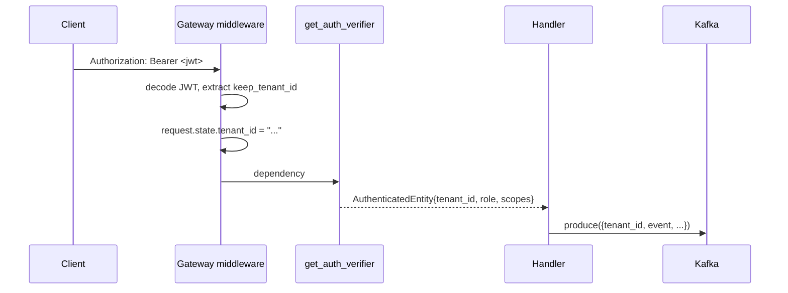

Every domain object in Keep has a `tenant_id`. This page explains where that id comes from, how it propagates across services, and what isolation guarantees the codebase actually provides.

## The constant

```python
SINGLE_TENANT_UUID = "keep"
```

Defined in `dependencies.py` of every Python service. It's the default tenant for single-tenant deployments and the literal value used in tests. Whenever you see `"keep"` as a UUID-like string in logs or queries, that's it.

## Three operating modes

Multi-tenancy is **not** a runtime flag — it's an emergent property of `AUTH_TYPE`:

| `AUTH_TYPE` | Tenant resolution | Use case |
| --- | --- | --- |
| `noauth` | Hardcoded to `"keep"`. | Local dev. |
| `db` | One tenant per API key. `TenantApiKey.tenant_id` FK. | Self-hosted single-tenant deployments. |
| `auth0` / `keycloak` / `okta` / `onelogin` / `oauth2proxy` | Tenant comes from the `keep_tenant_id` claim in the JWT. | Multi-tenant SaaS / managed deployments. |

The codebase is the same in all three; what differs is which `IdentityManager` validates the token and where it pulls `tenant_id` from.

## How `tenant_id` flows through a request

1. **Edge**: a request hits the Gateway carrying either an `Authorization: Bearer <jwt>` header, an `X-API-KEY` header, or HTTP Basic auth.
2. **Middleware**: `LoggingMiddleware` (`keep-api-gateway/src/middlewares.py`) decodes the credential and pulls out the tenant. For JWTs that's the `keep_tenant_id` claim; for API keys it's `TenantApiKey.tenant_id`. The result is stamped onto `request.state.tenant_id`.
3. **Auth dependency**: `IdentityManagerFactory.get_auth_verifier(scopes)` (used as a FastAPI `Depends`) resolves the same credential into an `AuthenticatedEntity` and asserts the required scopes. The entity carries `tenant_id`, `email`, `api_key_name`, `role` — and additional fields if the identity manager attached them (Keycloak adds `org_id`).
4. **Handler**: handlers receive `authenticated_entity: AuthenticatedEntity` and pass `authenticated_entity.tenant_id` to the business-logic layer.
5. **Cross-service**: the Gateway's Kafka envelope includes `tenant_id` explicitly. The Event Handler consumes that field directly — there is no token validation at the consumer.



## Tenant configuration

Some behaviour is per-tenant: dedup defaults, search-mode preference, custom fields, etc. Those live in the `Tenant` table's `configuration` JSON column.

`TenantConfiguration` is a singleton in-memory cache. It reloads every `TENANT_CONFIGURATION_RELOAD_TIME` minutes (default 5). Implications:

- Config changes you make through the API may take up to 5 minutes to propagate to other workers/pods.
- The cache is per-process — `N` Gunicorn workers means `N` independent caches.

If you need an immediate refresh in tests, call the singleton's `reload()` directly.

## Isolation: FK, not schema

Every fact table has a `tenant_id` FK back to `Tenant`:

- `Alert`, `Incident`, `Workflow`, `WorkflowExecution`, `WorkflowExecutionLog`
- `Provider`, `InstalledProvider`, `Secret`, `TenantApiKey`
- `MaintenanceWindowRule`, `Preset`, `AlertField`

There is **no schema-per-tenant**. All tenants share the same Postgres tables, distinguished only by the `tenant_id` column.

This is a deliberate trade-off:

| Pros | Cons |
| --- | --- |
| Cheap onboarding — adding a tenant is one row. | Per-tenant data deletion is a multi-table `DELETE … WHERE tenant_id = …`. |
| Schema migrations apply once. | Bug in a query that omits the `tenant_id` filter is a cross-tenant data leak. |
| Connection pooling / caching is straightforward. | Per-tenant DB-level resource limits aren't possible. |

The codebase enforces the `tenant_id` filter manually. There is no row-level security, no FK constraint that prevents a query from touching another tenant's data — the filter has to be in the `WHERE` clause. **Treat any new query helper that does not take `tenant_id` as a parameter with extreme suspicion**, and prefer extending the helpers in `keep-workflows/src/common/core/db.py` (the canonical query layer) over writing ad-hoc SQL.

## What about the Event Handler?

The Event Handler does not authenticate Kafka messages — it trusts the `tenant_id` field in the envelope. The trust boundary is therefore the **Kafka topic itself**: anyone who can produce to `keep-events` can claim any tenant.

In production this is fine because the topic is reachable only from the Gateway (network policy / private listener). It is worth knowing about when:

- you wire up a new producer (a sidecar, a CI tool that injects test events) — that producer can lie about `tenant_id`, so the topic ACL must be tight; or
- you change ingress to expose Kafka externally — don't, but if you must, add validation at the consumer.

## Where to look

- `keep-api-gateway/src/middlewares.py` — `LoggingMiddleware` tenant extraction.
- `keep-api-gateway/src/services/identity_manager/identitymanagerfactory.py` — auth verifier, tenant resolution per backend.
- `keep-api-gateway/src/repositories/dependencies.py` — `SINGLE_TENANT_UUID`, `TenantConfiguration`.
- `keep-workflows/src/common/core/db.py` — the canonical query layer; every helper takes `tenant_id`.
