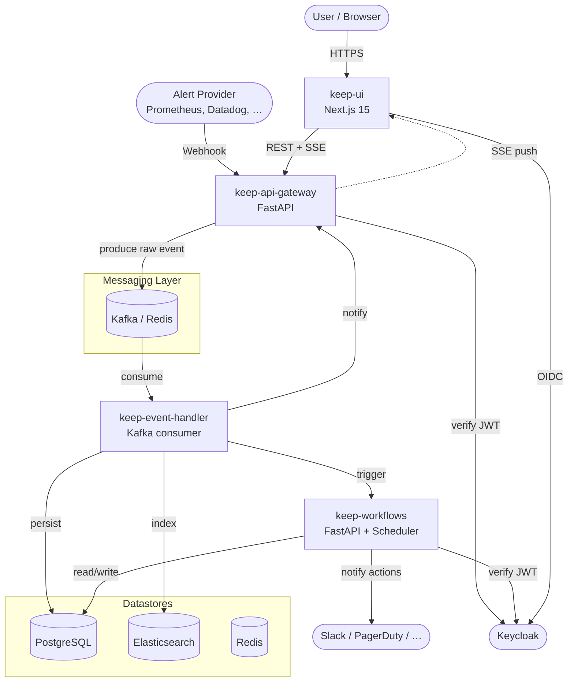

Keep runs as a small set of focused services connected by a message broker. This page is the map — the rest of the architecture section drills into individual edges.

## The big picture



## Services at a glance

| Service | Default port | Entry point | Owns |
| --- | --- | --- | --- |
| `keep-api-gateway` | 8080 | `src/main.py` (`get_app`) | HTTP API, auth, SSE, event production |
| `keep-event-handler` | 8082 (health) / 8083 (metrics) | `consumer_main.py` + `main.py` | Parsing, dedup, persistence, indexing |
| `keep-workflows` | 8082 | `src/main.py` | Workflow scheduling and execution |
| `keep/keep-ui` | 3000 | `npm run dev` | Next.js frontend |

Each backend service is a Poetry-managed Python project, runs Gunicorn + Uvicorn workers in production, and exposes Prometheus metrics + OpenTelemetry traces.

## The Kafka envelope

The Gateway and Event Handler are coupled only by the structure of the message they exchange. The Gateway produces a JSON object built in `keep-api-gateway/src/services/producers/kafka_producer.py` (around lines 107–118):

```json
{
  "event": "<the raw provider body, untouched>",
  "event_type": "alert",
  "tenant_id": "...",
  "provider_type": "...",
  "provider_id": "...",
  "fingerprint": "...",
  "api_key_name": "...",
  "trace_id": "...",
  "provider_name": "..."
}
```

Serialization is a defensive `json.dumps` that calls `.dict()` on Pydantic models and falls back to `str()` for anything else:

```python
json.dumps(payload, default=lambda o: o.dict() if hasattr(o, "dict") else str(o))
```

A few things worth knowing before you depend on the envelope:

- **Producer DLQ**: a publish that fails after `KAFKA_MAX_RETRIES` (default `3`) is sent to `KAFKA_DLQ_TOPIC` (default `keep-events-dlq`). This catches *broker-level* failures, not parsing failures inside the consumer — see [Messaging](/architecture/messaging) for the full reliability story.
- **Message key is `None` today**. Records are partitioned round-robin, which means **per-tenant ordering is not guaranteed** across consumer pods. A `firing → resolved` pair for the same fingerprint can be processed out of order if the partitions land on different consumers. This is a known limitation; the recommended fix is to set `key=tenant_id` (or `key=fingerprint`) at production time, and is tracked as a hardening item.
- **`event` is opaque** — it's whatever the provider sent, before any parsing. The Event Handler's provider class is what turns it into an `AlertDto`.

## Why this split?

1. **Isolation of failure**. A bad provider parser used to crash the API. Now the Gateway acks the request and the parsing failure is contained inside the Event Handler — it can be retried, dead-lettered, and replayed without affecting ingestion.
2. **Independent scaling**. Ingestion is IO-bound; processing is CPU-bound. We scale the Gateway horizontally for connection concurrency and the Event Handler for throughput, on independent dials.
3. **Pluggable messaging**. The `EventProducer` / `EventConsumer` abstraction lets us run on Kafka in production and Redis/ARQ in dev without touching business logic. See [Messaging](/architecture/messaging).
4. **Cleaner deploys**. Each service has its own repo, CI, container image, and release cadence.

## Shared concerns

Some concerns appear in multiple services and use the **same module name** in each. Treat the per-service copies as canonical — they are not currently published as a shared package.

- **Identity**: `identitymanager/` (Gateway, Workflows). Wraps Keycloak/NoAuth/Auth0 behind `IdentityManagerFactory.get_auth_verifier(scopes)`.
- **Providers**: `providers/` (Gateway, Event Handler, Workflows). Each integration is a self-contained `<name>_provider/` directory and registers with `ProvidersFactory`.
- **Database models**: SQLModel classes under `common/models/db/` (Workflows) and `models/` (others). Migrations are managed per-service via Alembic.
- **CEL**: `cel-python` for filters; SQL translation helpers under `common/core/cel_to_sql/`.

## Where the legacy code lives

The original monolith is preserved under `keep/keep/api/` (HTTP + ingestion) and `keep/keep/event_handler/` (worker). It still runs end-to-end via `entrypoint.sh`, but **all new feature work belongs in the dedicated service repositories**. The legacy paths are kept around for reference and to support in-flight migrations; expect them to be removed once parity is reached.

See [Repository Layout](/architecture/repository-layout) for the directory-level breakdown.
