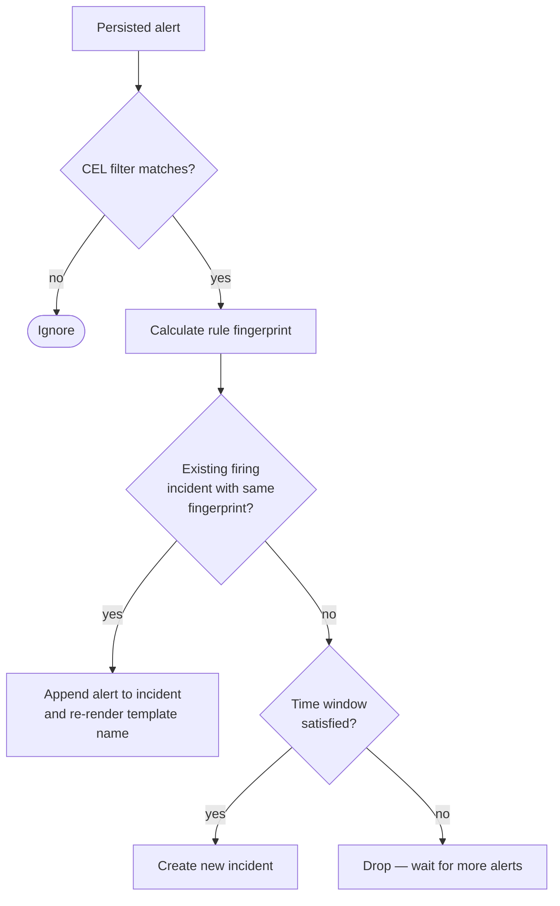

The **Rules Engine** is the intelligence layer that turns a stream of alerts into a stream of incidents. After the split, it runs **inside the Event Handler** — every processed alert hits `RulesEngine.evaluate_rules` immediately after persistence and indexing.

## Concept: alert vs. incident

- **Alert**: a transient notification ("CPU high on db-1").
- **Incident**: a persistent, stateful group of alerts ("Database cluster is down").

A correlation rule is the thing that decides which alerts belong in the same incident.

## The grouping logic

A rule has a `grouping_criteria` — a list of field names. For each incoming alert that matches the rule's CEL filter, the engine extracts the values for those fields and joins them into a **rule fingerprint**.

Example rule: `grouping_criteria: ["source", "service"]`

| Alert | Extracted fields | Rule fingerprint |
| --- | --- | --- |
| A | `source=datadog, service=payment-api, host=k8s-1` | `datadog,payment-api` |
| B | `source=datadog, service=payment-api, host=k8s-2` | `datadog,payment-api` |
| C | `source=datadog, service=auth-api,    host=k8s-1` | `datadog,auth-api` |

A and B share the same rule fingerprint → same incident. C lands in its own incident.

## Evaluation flow

### CEL matching (`_check_if_rule_apply`)

The rule's CEL expression is evaluated against the alert. Same `celpy.Environment()` used everywhere else in the codebase. Same severity-normalization helper.

### Time window

A rule can require N alerts within a sliding window before creating an incident. This avoids creating an incident for a single transient blip. The window is checked against the alerts already attached to candidate incidents and against unattached alerts in the same time bucket.

### Naming

The incident name is rendered from a template that has access to the same context vocabulary as workflows: `{{ service }}`, `{{ source }}`, etc. The template re-renders every time a new alert is attached, so the name reflects whichever value won the latest extraction.

## Multi-level rules

A single alert can trigger multiple rules. The current implementation **limits a multi-level rule to one grouping criterion** for simplicity — a rule with `grouping_criteria: ["service", "environment"]` is not "multi-level" (it produces one incident per `(service, environment)` tuple). True multi-level fanout (one alert → multiple incidents along orthogonal axes) is not supported.

## Drift across services

`_convert_filters_to_cel` and `preprocess_cel_expression` are duplicated between the Workflows engine and the Rules engine. If you change CEL preprocessing, change it in both places.

## Code reference

- **Main logic**: `keep-event-handler/rulesengine/rulesengine.py`.
  - `evaluate_rules` / `run_rules` — entry points called by `process_event`.
  - `_check_if_rule_apply` — CEL filter check.
  - `_calc_rule_fingerprint` — the hashing logic.
  - `_get_or_create_incident` — state management.
- **Models**: `Rule`, `Incident`, `AlertToIncident` — see the gateway's `keep-api-gateway/src/models/db/`.
- **HTTP CRUD**: `keep-api-gateway/src/routes/rules.py`.
