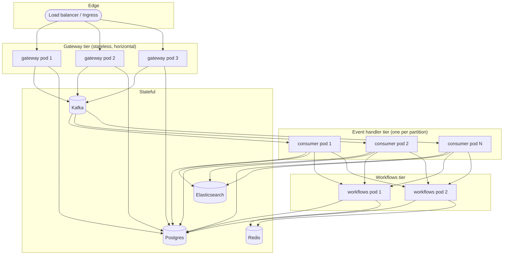

Keep ships as four containers, all stateless, fronted by Postgres, Redis, Kafka, and (optionally) Elasticsearch. This page is the deploy-time reference.

## Per-service Dockerfiles

Each repo has its own. The notable bits:

### `keep-api-gateway/Dockerfile`

- Base: `python:3.11.6-slim`.
- Poetry install of `pyproject.toml` into `/venv`.
- `ENTRYPOINT`: none — `CMD` runs Gunicorn directly.
- `CMD`: `gunicorn src.main:get_app --bind 0.0.0.0:8080 --workers $KEEP_WORKERS -k uvicorn.workers.UvicornWorker -c src/config/config.py`.
- The `-c src/config/config.py` Gunicorn config wires `on_starting()` (DB init, dashboard provisioning) and `post_worker_init()` (per-fork logging reset).

### `keep-event-handler/Dockerfile`

- Base: `python:3.11.6-slim`.
- Adds `librdkafka-dev`, `gcc`, `curl`.
- Two ports exposed: `8082` (health) and `8083` (Prometheus).
- Healthcheck: `curl -f http://localhost:8082/health`.
- `CMD`: `python consumer_main.py` — **no Gunicorn**. The consumer is a blocking loop, not an ASGI app.
- Run the FastAPI `main.py` (which does have health + metrics) as a sidecar or supervisor in production if you want the OTel instrumentation auto-attached to HTTP probes.

### `keep-workflows/Dockerfile`

- Base: `python:3.12-slim`.
- Poetry install (no dev deps): `poetry install --no-interaction --no-ansi --without dev --no-root`.
- `CMD`: `gunicorn src.main:app -w 4 -k uvicorn.workers.UvicornWorker --bind 0.0.0.0:8080`.
- Note port: this runs on `8080` *inside* the container; map to `8082` externally if you want it to match the dev server.

### `keep/keep-ui` (frontend)

- Next.js standalone output (`output: "standalone"` in `next.config.js`).
- Multi-stage build separates `npm ci` from `npm run build`.
- Resulting image is a slim `node:20` with the standalone server bundle.

### Legacy Dockerfile

`keep/docker/Dockerfile.api` still builds the original monolith image. It is **deprecated** — kept for in-flight migrations only. New deployments should not use it.

## Production topology

A reasonable production topology, in increasing complexity:

### Sizing rules of thumb

- **Gateways**: scale with concurrent connections (SSE clients dominate). Sticky sessions or Redis-based SSE fan-out is required for >1 pod (today the SSE broker is in-memory).
- **Event Handlers**: scale with Kafka partition count. One consumer pod per partition is the natural max.
- **Workflows**: scale with active workflow execution count. One pod per ~50 concurrent runs is a starting point given the default `KEEP_MAX_WORKFLOW_WORKERS=20`. Note the queue is in-memory + per-pod today, so multiple Workflows pods do not share work — they each run their own scheduler against the shared DB.

## Database migrations

Each service that owns schema runs Alembic against the same Postgres:

- `keep-api-gateway/alembic.ini` — owns `Tenant`, `TenantApiKey`, `Alert`, `Incident`, `Provider`, `Secret`, `MaintenanceWindowRule`, `AlertField`, etc.
- `keep-workflows/alembic.ini` — owns `Workflow`, `WorkflowExecution`, `WorkflowExecutionLog`, plus its own copy of provider/secret tables.

The **Event Handler does not run migrations** — it has no `alembic.ini` of its own. Schema changes that the Event Handler needs go through the Gateway's migration history. This is reasonable today (single DB) but worth knowing about so contributors don't go looking for migrations in the wrong repo.

## Consolidated env-var reference

The variables that actually affect production behaviour, by service:

### All services

| Variable | Default | Purpose |
| --- | --- | --- |
| `AUTH_TYPE` | `noauth` | Identity backend (`noauth`, `db`, `keycloak`, `auth0`, `okta`, `onelogin`, `oauth2proxy`). |
| `KEEP_API_URL` | derived | Public URL of the Gateway, used for callbacks and inter-service links. |
| `KEEP_VERSION` | from package | Reflected in `/` and OpenAPI. |
| `KEEP_OTEL_ENABLED` | `true` | Master OTel switch. |
| `OTEL_EXPORTER_OTLP_ENDPOINT` | unset | Base OTLP endpoint. |
| `LOG_LEVEL` | `INFO` | Per-service log level. |
| `KEEP_FORCE_CONNECTION_STRING` | unset | Override DB connection URL. |
| `KEEP_DB_PRE_PING_ENABLED` | `false` | Pre-ping connections to detect dropped DB connections. |

### Gateway

| Variable | Default | Purpose |
| --- | --- | --- |
| `PORT` | `8080` | Listen port. |
| `KEEP_WORKERS` | unset (Gunicorn default) | Gunicorn worker count. |
| `KEEP_LIMIT_CONCURRENCY` | unset | Per-worker concurrency cap. |
| `KEEP_USE_LIMITER` | `false` | Enable `slowapi` rate limiting (app-wide). |
| `KEEP_METRICS` | `true` | Expose Prometheus `/metrics`. |
| `KEEP_CORS_TRUSTED_ORIGINS` | `KEEP_PLATFORM_URL` | Comma-separated allowed origins. |
| `CONSUMER` | `true` | Run the in-process `EventSubscriber` for pull-mode providers. |
| `MESSAGING_TYPE` | `KAFKA` | Broker selector. |

### Event Handler

| Variable | Default | Purpose |
| --- | --- | --- |
| `MESSAGING_TYPE` | `KAFKA` | `KAFKA` (consumer_main.py) or `REDIS` (FastAPI lifespan). |
| `KAFKA_BOOTSTRAP_SERVERS` | `localhost:29092` | Comma-separated brokers. |
| `KAFKA_TOPIC` | `keep-events` | Topic. |
| `KAFKA_CONSUMER_GROUP` | `keep-event-handler` | Group id. |
| `KAFKA_DLQ_TOPIC` | `keep-events-dlq` | Producer DLQ destination. |
| `KAFKA_DLQ_BOOTSTRAP_SERVERS` | falls back to `KAFKA_BOOTSTRAP_SERVERS` | Optional separate broker for the DLQ. |
| `KAFKA_DLQ_SASL_USERNAME` / `KAFKA_DLQ_SASL_PASSWORD` | fall back to `KAFKA_SASL_*` | Optional separate creds for the DLQ producer. |
| `KAFKA_MAX_RETRIES` | `3` | Producer retry count before falling back to DLQ. |
| `KAFKA_POLL_TIMEOUT_SECONDS` | `1.0` | poll() timeout. |
| `KAFKA_SESSION_TIMEOUT_MS` | `45000` | Heartbeat window. |
| `KAFKA_MAX_POLL_INTERVAL_MS` | `300000` | Max gap between polls. |
| `MAX_PROCESSING_RETRIES` | `3` | Per-message retry attempts. |
| `PROMETHEUS_METRICS_PORT` | `8083` | Standalone consumer metrics port. |
| `HEALTH_CHECK_PORT` | `8082` | Standalone consumer health port. |
| `ELASTIC_ENABLED` | `false` | Toggle ES indexing. |
| `KEEP_STORE_RAW_ALERTS` | `false` | Persist raw payload alongside DTO. |
| `KEEP_ALERT_FIELDS_ENABLED` | `true` | Maintain the `AlertField` index for facets. |
| `KEEP_MAINTENANCE_WINDOWS_ENABLED` | `true` | Run maintenance-window CEL eval. |
| `KEEP_AUDIT_EVENTS_ENABLED` | `true` | Write audit rows. |
| `KEEP_DEDUPLICATION_DISTRIBUTION_ENABLED` | unset | Write dedup stats. |

### Workflows

| Variable | Default | Purpose |
| --- | --- | --- |
| `KEEP_WORKFLOWS_HOST` | `0.0.0.0` | Bind address. |
| `KEEP_WORKFLOWS_PORT` | `8082` | Bind port. |
| `KEEP_MAX_WORKFLOW_WORKERS` | `20` | Executor pool size. |
| `WORKFLOWS_INTERVAL_ENABLED` | `"true"` | Gate interval-scheduled workflows. |
| `WORKFLOWS_TIMEOUT` | `120` (minutes) | Wall-clock cap before marking ERROR. |
| `KEEP_READ_ONLY` | `"false"` | Inserts a 3-second sleep per workflow. |
| `WORKFLOW_MANAGER_DEBUG` | `"false"` | DEBUG logging in WorkflowManager. |
| `SECRET_MANAGER_TYPE` | `file` | `file`, `db`, `vault`, `gcp`, `aws`, `kubernetes`. |
| `SECRET_MANAGER_DIRECTORY` | `./secrets` | When using the `file` backend. |

## Operational caveats

- **Single Gateway pod is the safest configuration today** for SSE delivery. Multiple pods require sticky sessions or you'll miss events on a per-tenant basis. Tracked.
- **Single Workflows pod** is similarly the safest configuration — the in-memory queue does not distribute. Multiple pods means each scheduler polls the DB independently and runs whatever it pulls. Use `NONPARALLEL` strategies if you must run multiple.
- **Event Handler pods scale freely** — Kafka does the partitioning. The constraint is your topic's partition count.
- **Frontend → Workflows routing**: the UI calls `/workflows/...`; whether the Gateway proxies or the UI hits Workflows directly is environment-config-dependent. Set this up explicitly in your reverse proxy / ingress.
