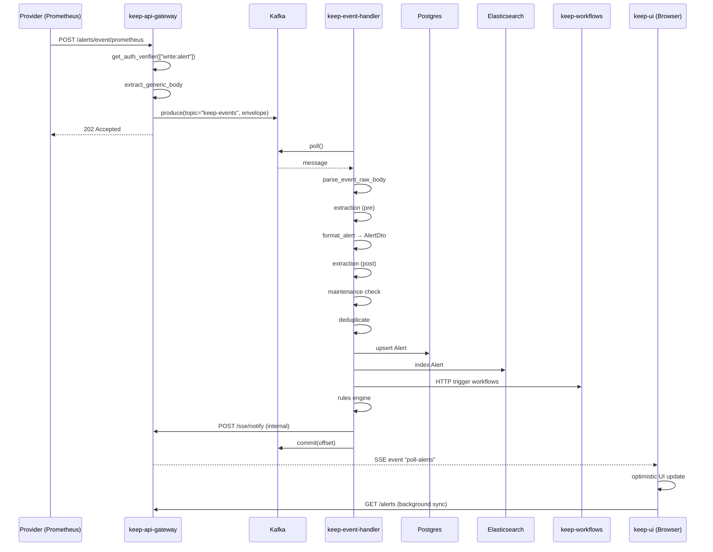
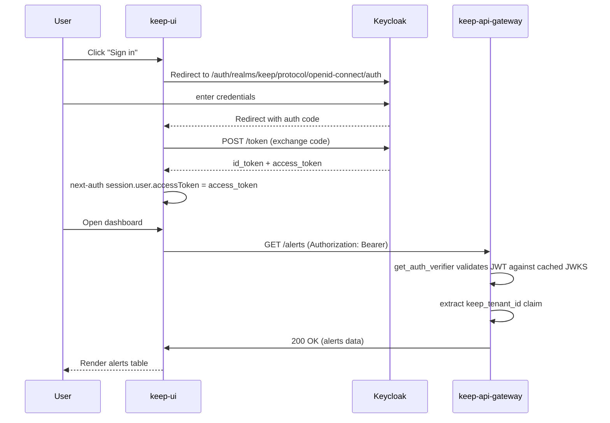
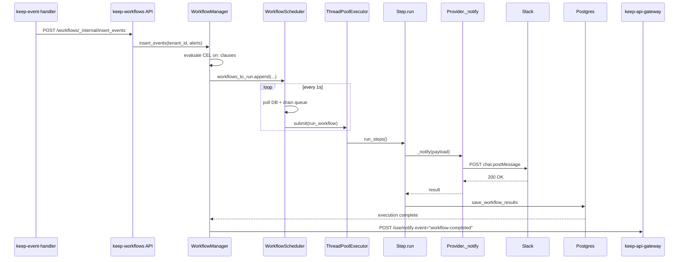
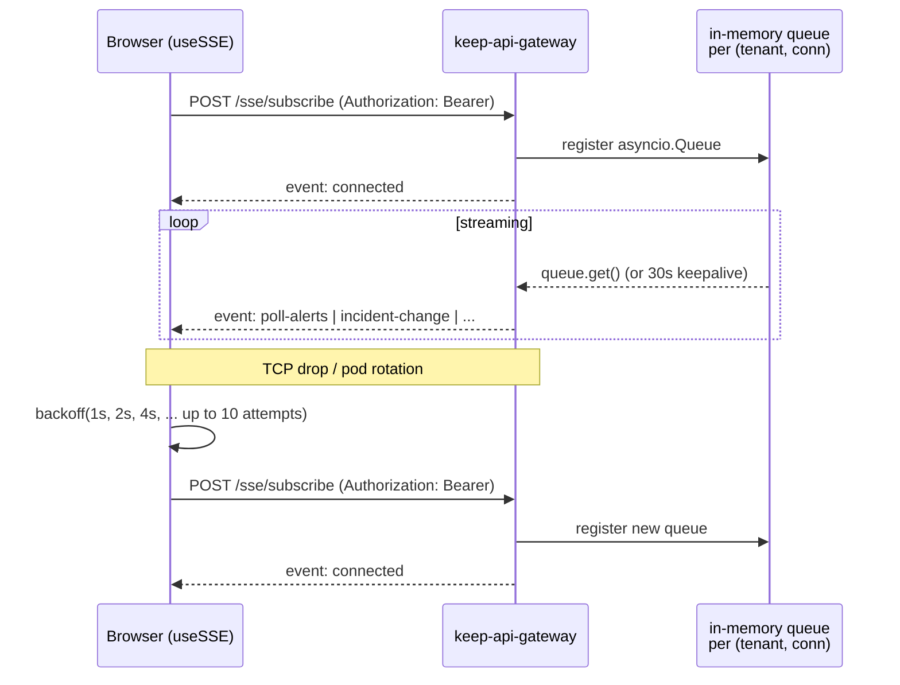

These are the load-bearing flows in Keep. Each one crosses at least two services — the diagrams show *where* the boundaries are.

## Story 1 — Alert ingestion

The latency budget breaks down roughly as:

- Gateway auth + produce: < 10 ms.
- Kafka end-to-end: 10–50 ms.
- Event Handler pipeline: 50 ms (simple alert) to 500 ms+ (heavy extraction + ES indexing).
- SSE notify → UI render: < 100 ms.

If any one of those blows out, [Observability](/operations/observability) tells you where to look.

## Story 2 — User login (Keycloak)

The first request to a new instance of the Gateway fetches Keycloak's JWKS over HTTP and caches it; subsequent requests verify locally.

## Story 3 — Workflow execution

The strategy enum decides what happens on collision (same workflow + same fingerprint, already running). See [Workflows / Scheduler internals](/services/workflows#scheduler-internals).

## Story 4 — SSE reconnection

Two known limitations of this flow:

1. **Per-process state**: the queue map lives in the receiving Gateway pod. A reconnect that lands on a different pod creates a fresh queue — events that arrived during the disconnect window are lost. Sticky sessions (or moving the broker into Redis pub/sub) is the fix.
2. **Token-in-URL fallback**: clients that can't set headers on `EventSource` send the token in a query parameter. Treat this as a security smell, not a feature.
