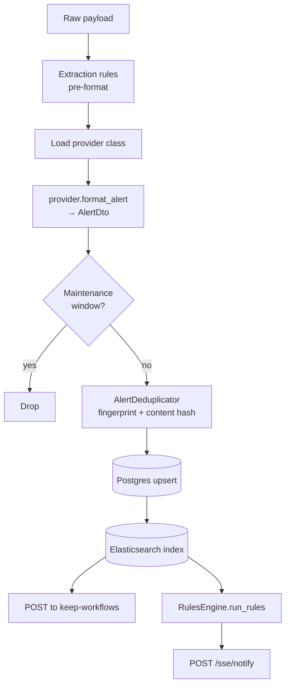

The **Event Handler** (`keep-event-handler`) is where alerts are parsed, deduplicated, persisted, indexed, and used to trigger workflows and rules. It is the only service that runs CPU-heavy work; the Gateway is intentionally dumb.

## Responsibilities

- Consume raw events from Kafka (production) or Redis/ARQ (dev/legacy).
- Run extraction rules and load the right Provider class to format the alert.
- Compute fingerprints and deduplicate against the latest known alert.
- Upsert alerts in PostgreSQL and index them in Elasticsearch.
- Hand off to the Workflows service for matching workflows.
- Run the rules engine to correlate alerts into incidents.
- Notify the API Gateway over an internal HTTP call so SSE clients update in realtime.

## Two entry points

The repository ships **two** Python entry points. Both are real — they handle different concerns and can run side-by-side.

### `consumer_main.py` (production consumer)

A blocking, synchronous Kafka consumer loop using `confluent-kafka`. It:

1. Initializes services (`init_services`) — sets up DB engine, identity manager, etc.
2. Starts the Prometheus metrics HTTP server on `PROMETHEUS_METRICS_PORT` (default `8083`).
3. Starts a tiny `http.server` for K8s health probes on `HEALTH_CHECK_PORT` (default `8082`).
4. Creates a `KafkaEventConsumer` and calls `consumer.start()` — blocks forever.

```bash
python -m keep.event_handler.consumer_main
# or, from the repo root
python consumer_main.py
```

This is the default `CMD` in the production Dockerfile — no Gunicorn involved.

### `main.py` (FastAPI app)

A FastAPI app that exposes `/v1/health` and `/v1/metrics`, plus instrumentation for Prometheus and OpenTelemetry. It is suitable for K8s liveness/readiness probes when you don't want to run a separate health server.

For the **Redis/ARQ** code path it doubles as the consumer: the FastAPI lifespan in `core/lifespan.py` boots an ARQ worker. For Kafka it intentionally does not start a consumer — the standalone `consumer_main.py` does that.

```bash
# health + metrics surface (no consumer)
python main.py            # uvicorn on PORT (default 8081)
# Redis/ARQ consumer mode
MESSAGING_TYPE=REDIS python main.py
```

In production with Kafka you typically run **both** in the same pod: `consumer_main.py` as the main process and `main.py` as a sidecar (or vice-versa).

## Layout

```
keep-event-handler/
├── main.py                     # FastAPI app (health + metrics)
├── consumer_main.py            # Kafka consumer loop (standalone)
├── observability.py            # OTel setup
├── logging_conf.py             # structlog/JSON logging
├── api/routes/v1/
│   ├── health.py
│   └── metrics.py
├── core/
│   ├── lifespan.py             # FastAPI lifespan (Redis path)
│   ├── bootstrap.py            # init_services + ARQ worker plumbing
│   ├── kafka_consumer.py       # KafkaEventConsumer (confluent-kafka)
│   ├── init.py                 # init_services
│   ├── elastic.py              # ElasticClient
│   ├── incidents.py
│   ├── metrics.py              # prometheus_client counters / summaries
│   ├── sse.py                  # client for /sse/notify on the Gateway
│   └── tenant_configuration.py
├── controllers/
│   └── event_controller.py     # process_event_sync — the orchestrator
├── alert_deduplicator/
├── rulesengine/
├── event_management/
├── event_subscriber/           # in-process (legacy) subscribers
├── providers/                  # provider classes used for parse_event_raw_body
├── identitymanager/, secretmanager/, contextmanager/, parser/
└── models/
    └── event_dto.py
```

## The processing pipeline

`controllers/event_controller.py::process_event_sync` is the heart of the service:



Key collaborators:

- **`ProvidersFactory.get_provider_class(provider_type)`** — dynamic lookup. Each provider implements `parse_event_raw_body` and `format_alert`.
- **`EnrichmentsBl`** — runs tenant-defined extraction and mapping rules.
- **`AlertDeduplicator`** — SHA-256 hash with `ignore_fields` removed, compared to the latest stored alert with the same fingerprint.
- **`ElasticClient`** — lazy-initialized; no-op if Elasticsearch is not configured for the tenant.
- **`RulesEngine`** — CEL-based correlation, attaches alerts to incidents.

## Deduplication

This is where most of Keep's smarts live. The implementation is in `keep-event-handler/alert_deduplicator/alert_deduplicator.py`.

### The algorithm

For every incoming alert, the deduplicator computes a content hash:

```python
alert_copy = copy.deepcopy(alert)
for field in rule.ignore_fields:
    alert_copy = self._remove_field(field, alert_copy)

alert_hash = hashlib.sha256(
    json.dumps(alert_copy.dict(), default=str, sort_keys=True).encode()
).hexdigest()
```

Two things to notice:

1. **Canonical JSON** — `sort_keys=True` makes the hash deterministic across Python dict orderings.
2. **`ignore_fields`** is per-rule. Common entries are `lastReceived` and `firingCounter` — fields that change on every heartbeat but don't represent a state change. If you add a high-cardinality timestamp/counter field to `AlertDto`, you almost certainly want it in `ignore_fields` for the default rule, otherwise every heartbeat looks like a partial duplicate.

### The decision

The deduplicator looks up the last-seen alert for the same fingerprint via `get_last_alert_hashes_by_fingerprints(tenant_id, [alert.fingerprint])` and produces three possible outcomes:

| Outcome | Condition | Action |
| --- | --- | --- |
| `isFullDuplicate=True` | Same fingerprint, same hash | Update `lastReceived`, increment `firingCounter`. No new history row. |
| `isPartialDuplicate=True` | Same fingerprint, different hash | Treat as a state change (e.g. severity went `warning` → `critical`). New history row. |
| neither | No prior alert with this fingerprint | Insert new row. |

### Rule resolution

`get_deduplication_rules(tenant_id, provider_id, provider_type)` resolves which rule to apply (provider-specific or the default). The default rule's UUID is hard-coded; if you don't define a rule for a provider you fall back to it. Distribution stats (`KEEP_DEDUPLICATION_DISTRIBUTION_ENABLED`) write a `deduplication_event` row whenever a rule fires — useful for "show me how often we deduplicate Datadog vs Prometheus" dashboards, off by default in dev because it doubles write traffic.

### Why this matters

Dedup happens **before** the DB write. Get it wrong and you either:

- bloat the alerts table (`ignore_fields` too aggressive — every heartbeat is "new"); or
- silently drop state changes (`ignore_fields` too lax — a severity bump looks like a duplicate).

When changing dedup behaviour, ship a migration plan for existing rows: the hash is computed at write time, so a code change doesn't retroactively re-deduplicate the past.

## Configuration

| Variable | Default | Purpose |
| --- | --- | --- |
| `MESSAGING_TYPE` | `KAFKA` | Selects code path: `KAFKA` (consumer_main.py) or `REDIS` (FastAPI lifespan). |
| `KAFKA_BOOTSTRAP_SERVERS` | `localhost:29092` | Comma-separated brokers (also accepts a JSON array). |
| `KAFKA_TOPIC` | `keep-events` | Topic. |
| `KAFKA_CONSUMER_GROUP` | `keep-event-handler` | Group id. |
| `KAFKA_POLL_TIMEOUT_SECONDS` | `1.0` | poll() timeout. |
| `KAFKA_SESSION_TIMEOUT_MS` | `45000` | Heartbeat window. |
| `KAFKA_MAX_POLL_INTERVAL_MS` | `300000` | Max gap between polls. Increase if your handler is slow. |
| `KAFKA_SECURITY_PROTOCOL` | `PLAINTEXT` | `PLAINTEXT`, `SSL`, `SASL_SSL`. |
| `KAFKA_SASL_*` | `null` | When using SASL. |
| `KAFKA_SSL_CAFILE` | `null` | CA bundle path. |
| `MAX_PROCESSING_RETRIES` | `3` | In-process retries before logging an error and acking. |
| `PROMETHEUS_METRICS_PORT` | `8083` | Where the standalone consumer exposes metrics. |
| `HEALTH_CHECK_PORT` | `8082` | Where the standalone consumer exposes `/health`. |
| `PORT` | `8081` | Where `main.py` listens (FastAPI app). |
| `KEEP_OTEL_ENABLED` | `true` | Configure OTel SDK. |
| `LOG_LEVEL` | `INFO` | Per-process log level. |

## Metrics

`core/metrics.py` defines the canonical metric set. The most useful ones in dashboards:

| Metric | Type | Labels | Meaning |
| --- | --- | --- | --- |
| `events_in_counter` | Counter | `provider_type`, `tenant_id` | Messages dequeued. |
| `events_out_counter` | Counter | `provider_type`, `tenant_id`, `result` | Messages successfully processed. |
| `events_error_counter` | Counter | `provider_type`, `tenant_id`, `error_type` | Parsing / processing failures. |
| `processing_time_summary` | Summary | `provider_type` | End-to-end processing latency. |

## Run / test

```bash
poetry install --with dev

# Kafka consumer (standalone)
poetry run python consumer_main.py

# FastAPI app (health + metrics)
poetry run python main.py

# Tests
poetry run pytest tests/
```

The Dockerfile installs `librdkafka` and runs `python consumer_main.py` as the default command.

## Failure / retry semantics

- Parsing errors increment `events_error_counter` and ack the message after `MAX_PROCESSING_RETRIES` to avoid head-of-line blocking. A DLQ topic is on the roadmap.
- DB write errors propagate; the consumer does **not** commit the offset, so the message is redelivered.
- Workflow / rule failures are scoped to the workflow run; they don't affect alert persistence.

## See also

- [Architecture / Messaging](/architecture/messaging) for the broker abstraction.
- [Components / Alert Manager](/components/alert-manager) for the dedup deep-dive.
- [Components / Rules Engine](/components/rules-engine) for the correlation logic.
